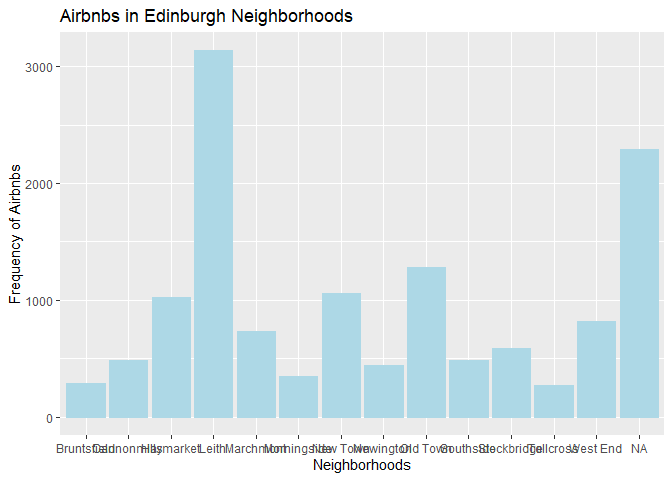
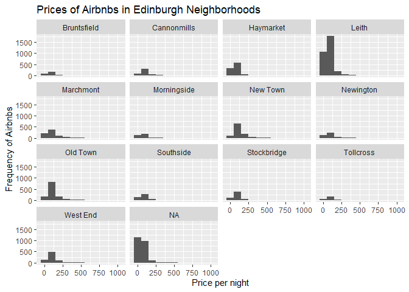

Recent development in Edinburgh regarding the growth of Airbnb and its impact on the housing market means a better understanding of the Airbnb listings is needed. Using data provided by Airbnb, we can explore how Airbnb availability and prices vary by neighborhood.

The data come from the [Kaggle database](https://www.kaggle.com/thoroc/edinburgh-inside-airbnb/version/2). It's 
been modified to better serve the goals of this exploration.

## Learning goals

The goal of this assignment is not to conduct a thorough analysis of Airbnb listings in Edinburgh, but instead to give you another chance to practice your workflow, data visualization, and interpretation skills.


## Getting started

Click on the link emailed to you to create your HW 1 repo, which should be named `hw-01-airbnb-YOUR_GITHUB_USERNAME`. Grab the URL of the repo, and use it to create a new Git project in RStudio. Refer to Lab 01 if you would like to see step-by-step instructions for cloning a Git repo into an RStudio project.  Open the R Markdown document `hw-01-airbnb.Rmd` using the `Files` tab in R Studio.


## Packages

I will often use the **emo** package to make it easy to insert emoji into R Markdown documents. When I do use it, I will refer to each emoji using the package name, so you will not need to include `library(emo)` in the R Markdown document.  You will however, need to install this package once in order to knit this document and any other R Markdown documents in the future that use the **emo** package.  Run the following commands in the Console to install the **emo** package:


```r
install.packages("devtools")
devtools::install_github("hadley/emo")
```

For this homework assignment, we will use the **tidyverse** package:


```r
library(tidyverse)
```
Now, knit this document. Make sure it compiles without errors. The output will be in the markdown `.md` file with the same name.  The `.md` file is readable in Github.  After you knit, the `.html` file is also generated.  (HTML is rendered as plain text on Github and is difficult to read, so sometimes it is helpful to also keep the `.md` file.)

## Data

The dataset you'll be using is called `edibnb` and it can be found in your repository.  You can read it in using the following code:


```r
load(file = "edibnb.rda")
```


1. Click on the green `Run Current Chunk` arrow to the right of the `load-packages` code chunk above.  Now do the same for the `load-data` chunk above. (Using the option `Run Current Chunk` is like running that chunk of code in the Console.)  Finally, run `View(edibnb)` in your Console to view the data in the data viewer (note: you should not put this function in your R Markdown document, but instead type it directly in the Console, as it pops open a new window). What does each row in the dataset represent?

  each row is an individual airbnb in Edinburgh


2. How many observations (rows) does the dataset have? Instead of hard coding the number in your answer, use inline code. 

  13,245 observations, meaning there are 13, 245 different airbnbs in this dataset

**Hint:** The Markdown Quick Reference sheet has an example of inline R code that might be helpful. You can access it from the Help menu in RStudio.

✅ ⬆️ *Now is a good time to commit and push your changes to GitHub with an appropriate commit message. Make sure to commit and push all changed files (.Rmd, .md, and .html) so that your Git pane is cleared up afterwards.*

Each column represents a variable. We can get a list of the variables in the data frame using the `names()` function.


```r
names(edibnb)
```

```
##  [1] "id"                   "price"                "neighbourhood"       
##  [4] "accommodates"         "bathrooms"            "bedrooms"            
##  [7] "beds"                 "review_scores_rating" "number_of_reviews"   
## [10] "listing_url"
```
3.  Create a suitable visualization for the distribution for Airbnb prices and describe the shape of the distribution.  Be sure to give your visualization(s) suitable axis labels and a title.


```r
ggplot(data = edibnb, 
       mapping = aes(x = price)) +
  geom_histogram(binwidth = 40, fill = "light blue", color = "blue") +
  labs(title = "Prices Per Night for Edinburgh Airbnbs", x = "Price per night", y = "Frequency of Airbnbs")
```

```
## Warning: Removed 199 rows containing non-finite values (`stat_bin()`).
```

<!-- -->
  It appears that the histogram representing the price of Edinbourough Airbnbs is right skewed with a few very high outliers. the majority of airbnbs, though, are under 125 pounds per night.  
  
  
4.  Create a suitable visualization for the distribution of neighbourhood.  Which neighbourhood in Edinburgh has the most AirBnB listings in this dataset?  Be sure to give your visualization suitable axis labels and a title.

```r
ggplot(data = edibnb, 
       mapping = aes(x = neighbourhood)) +
  geom_bar(color = "light blue", fill = "light blue") +
  labs(title = "Airbnbs in Edinburgh Neighborhoods", x = "Neighborhoods", y = "Frequency of Airbnbs")
```

<!-- -->
   Leith has the most Airbnb listings. 

5. Create a faceted histogram where each facet represents a neighborhood and displays the distribution of Airbnb prices in that neighborhood. Be sure to use a suitable bin width for your histograms, and include a meaningful title for your plot.


```r
ggplot(data = edibnb, 
       mapping = aes(x = price)) +
  geom_histogram(binwidth = 100) +
  labs(title = "Prices of Airbnbs in Edinburgh Neighborhoods",
       y = "Frequency of Airbnbs",
       x = "Price per night") +
  facet_wrap(~ neighbourhood)
```

```
## Warning: Removed 199 rows containing non-finite values (`stat_bin()`).
```

<!-- -->
**Note:** The plot will give a warning about some observations with non-finite values for price being removed. Don't worry about the warning, it simply means that 199 listings in the data didn't have prices available, so they can't be plotted.

✅ ⬆️ *Commit and push your changes again.*

6. Create a similar visualization, this time showing the distribution of review scores (`review_scores_rating`) by neighborhood.  Be sure to use a suitable bin width for your histograms, and include a meaningful title for your plot.  As part of your answer, include a brief interpretation of how Airbnb guests in general rate properties in these neighborhoods and how the neighborhoods compare to each other in terms of their ratings.  You should type your answer after your plot code.


```r
ggplot(data = edibnb, 
       mapping = aes(x = review_scores_rating)) +
  geom_histogram(binwidth = 7) +
  labs(title = "Ratings of Airbnbs in Edinburgh Neighborhoods",
       y = "Frequency of Airbnbs",
       x = "Rating (0-100)") +
  facet_wrap(~ neighbourhood)
```

```
## Warning: Removed 2177 rows containing non-finite values (`stat_bin()`).
```

<!-- -->
  It appears that Airbnb guests generally leave very high ratings that typically range from about 75% to 100%. Further, from town to town, it appears every town has a similar distribution of ratings being left skewed and the majority of observations in the 90% to 100% rating range. There is really only one observation that stands out from the rest of the observations across the different towns. That observation is the one in the town marked "NA" and it appears to have a rating of about 60%. 

7.  Create an alternative visualization to show the distribution of review scores by neighborhood.  Your visualization does not necessarily need to use faceting.


```r
ggplot(data = edibnb, 
       mapping = aes(x = neighbourhood, y = review_scores_rating)) +
  geom_boxplot(color = "dark blue", fill = "light blue") +
  labs(title = "Ratings of Airbnbs in Edinburgh Neighborhoods",
       y = "Rating",
       x = "Neighborhoods")
```

```
## Warning: Removed 2177 rows containing non-finite values (`stat_boxplot()`).
```

<!-- -->
I really like the boxplots of the neighborhoods because then I can better see that the median rating for all of the towns is around 90%. I also like the boxplots better because I can see some of the lower ratings and very low rating outliers that I couldn't see as well in the histograms above. 

✅ ⬆️ *Commit and push your changes again.*
